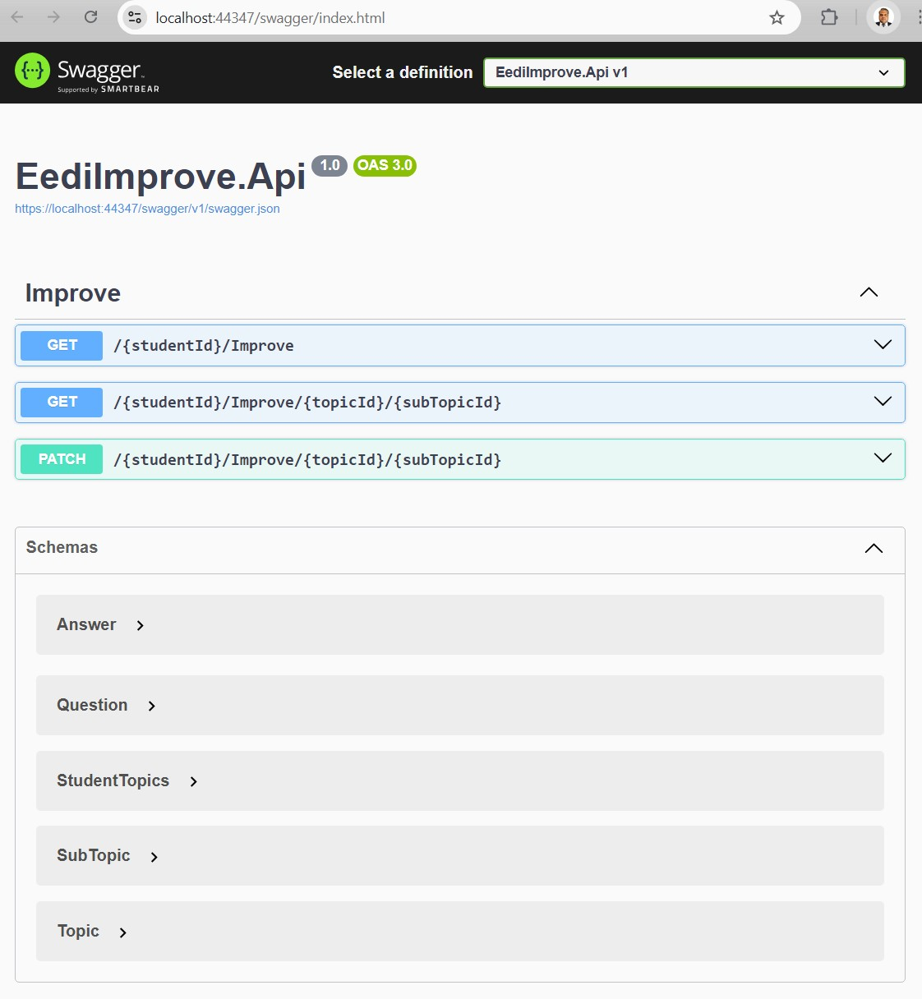
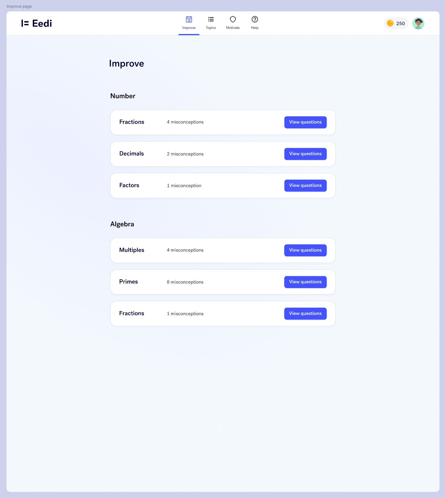
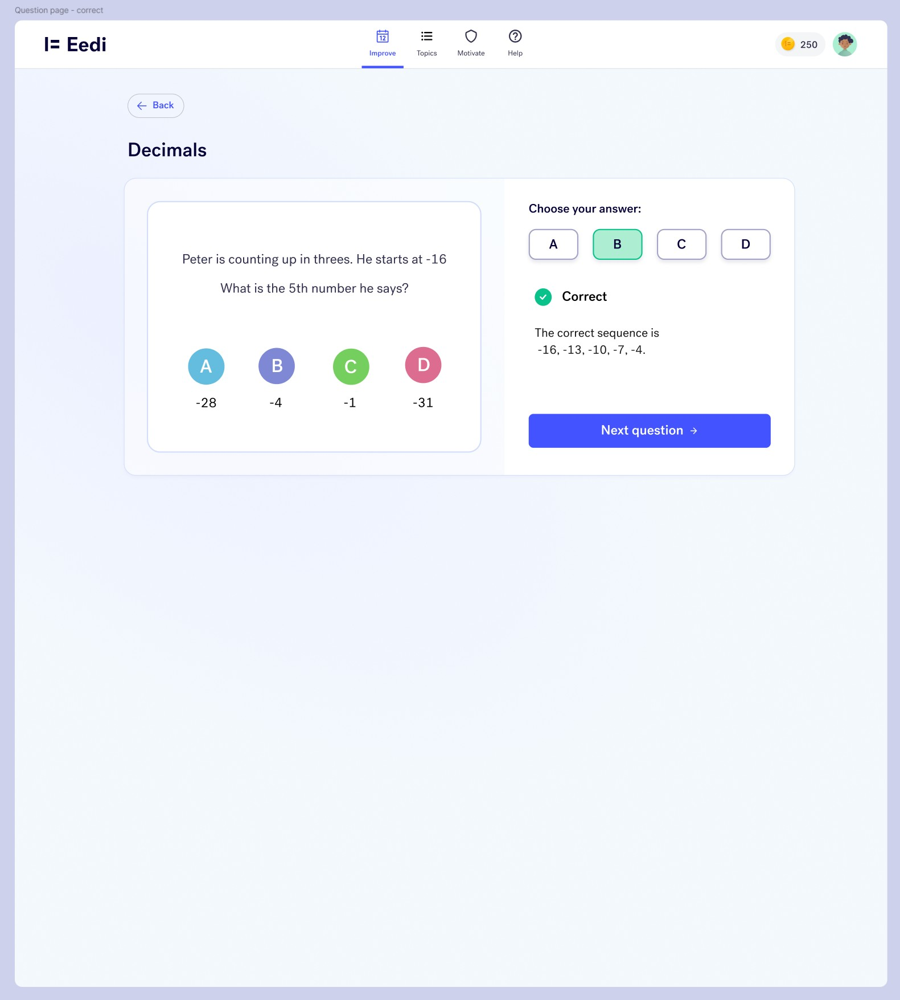
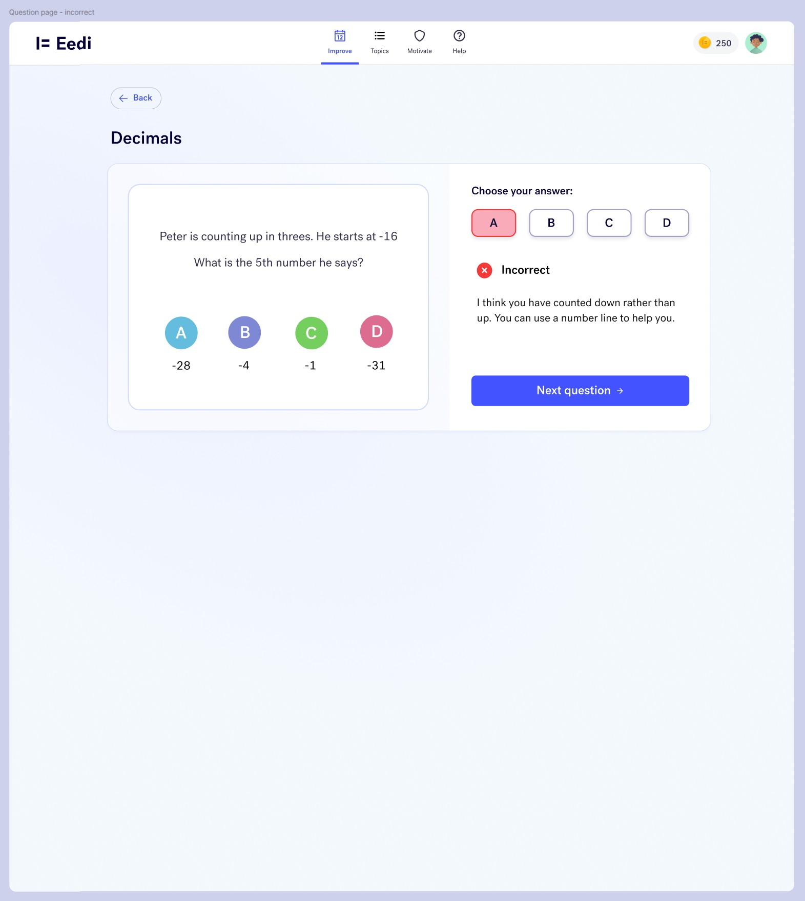
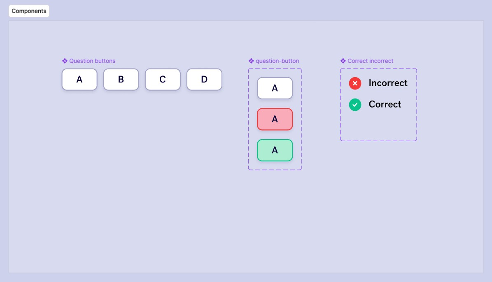
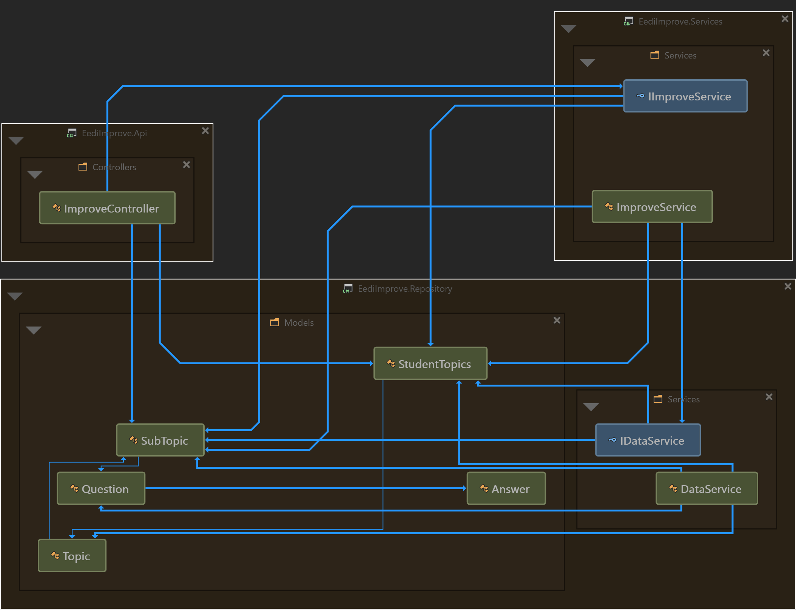

# eedi-improve
This is an API project for a new feature  in the Eedi product, and spec out the data structures and the endpoints that will allow a frontend engineer to implement it.

## improve feature
- Teachers would like a new section that allows students to independently review and re-answer questions that they have previously answered incorrectly.
- This will be useful if there is a student who has completed their assigned in class work quickly and the teacher wants to give them extra work to do.
- A student should be able to view the topics where they have incorrect answers, select a topic, view questions again, and update their previous answer.
- We’re calling this section `Improve`.
- In Figma, you'll see a [proposed design and flow for the improve section](https://www.figma.com/design/cBhoA2SdIGTQgDpm2jj9cu/Improve?node-id=0-1&m=dev&t=etApngCTOKBm7hsM-1).

## list page
This section lists topics and sub-topics where the current student has misconceptions.
- It should list sub-topics grouped by their parent topic.
- Each sub-topic will have a number of misconceptions (previously answered questions that the student got wrong).
- Sub-topics with no misconceptions will not be shown in this list.

## view page
When a student clicks "View Questions" for a particular sub-topic they will be taken to a single question page where they can view one question that they answered incorrectly and re-answer.
- All questions are images.
- All questions can only be answered A, B, C or D and one answer is correct.
- Each answer also has an explanation that can be shown to the student.

## task
Based on the design and requirements, you will need to do the following.
- Design the API endpoints that will provide the functionality for the Improve section.
- Show example requests & responses for these endpoints.
- Include any notes based on the assumptions you've made.

## solution
A single API endpoint with 3 methods, utilising 2 verbs - `GET` & `PATCH`.

#### `GET` - list page
```
https://{domain}/{studentId}/improve
```
- This serves the initial page load, which lists all topics allocated to the student & the underlying sub-topics.
- :bell: The list of questions is not provided in the sub-topics, as they're not really needed for the initial page; only required when a student wants to revisit a sub-topic.
- This should also help with the latency, because the questions are supposed to be images and it made sense to load the necessary ones and only when needed i.e., in the next `GET` call where a student chooses a sub-topic to work on.
    <details>
    <summary><ins style="cursor: pointer">Expand for an example result</ins></summary>

        {
            "StudentId": "e5b32b1e-9880-47f9-a7cf-d1f9e6a43116",
            "AllocatedTopics": [
                {
                    "TopicId": 1,
                    "TopicName": "Basic Math",
                    "SubTopics": [
                        {
                            "SubTopicId": 1,
                            "SubTopicName": "Addition and Subtraction",
                            "TotalMisconceptions": 0,
                            "Questions": null
                        },
                        {
                            "SubTopicId": 2,
                            ...
                        }
                    ]
                },
                {
                    "TopicId": 2,
                    "TopicName": "Measurement and Time",
                    "SubTopics": [
                        ...
                    ]
                }
            ]
        }
    </details>

#### `GET` - question page
```
https://{domain}/{studentId}/improve/{topicId}/{subTopicId}
```
- This is to be called when a student selects a sub-topic to correct previously-incorrect answers.
- This endpoint method returns a list of all questions pertaining to the chosen sub-topic, along with all the corresponding necessary details.
- :bell: Generally speaking, the list of questions could've been array of questions, and not just limited to the 4 options i.e., A, B, C & D. Also, the Correct & Selected AnswerId could've been a list of `int`.
- :bell: However, this would've been an expansion over the requirements, and I chose to stick to the exact requirements.
    <details>
    <summary><ins style="cursor: pointer">Expand for an example result</ins></summary>

        {
            "SubTopicId": 1,
            "SubTopicName": "Addition and Subtraction",
            "TotalMisconceptions": 0,
            "Questions": [
                {
                    "QuestionId": 1,
                    "QuestionDescription": "What is 3 + 5?",
                    "AnswerA": {
                        "AnswerId": 1,
                        "AnswerExplanation": "8"
                    },
                    "AnswerB": {
                        "AnswerId": 2,
                        "AnswerExplanation": "7"
                    },
                    "AnswerC": {
                        "AnswerId": 3,
                        "AnswerExplanation": "9"
                    },
                    "AnswerD": {
                        "AnswerId": 4,
                        "AnswerExplanation": "6"
                    },
                    "CorrectAnswerId": 1,
                    "SelectedAnswerId": 1
                },
                {
                    "QuestionId": 2,
                    ...
                }
            ]
        }
    </details>

#### `PATCH`
```
https://{domain}/{studentId}/improve/{topicId}/{subTopicId}
```
- :bell: A big assumption at my end here was that there would be potentially a `Submit` button at the end of the questionnaire for each sub-topic.
- This endpoint would be called on the click of the `Submit` button, and essentially save the data to the database of some sort.
- Another assumption was that once a student clicks `Submit`, the natural next step would be land the student on the main `list` page with the latest data.
- With this in mind, this endpoint method was designed to return a list of all topics i.e., the first `GET` method.

## dev notes
#### slight drift from requirements
- In addition to the assumptions mentioned in the sections above, I drifted slightly from the requirements wherein the first `GET` call will return all sub-topics irrespective of any misconceptions.
- I did so with the belief that it's good for the morale of the students to see what they were successful in, instead of showing them only those things where they went wrong.
- I've put a `TODO` comment in the code where this logic could potentially be applied, should this requirement be non-negotiable.

#### student data samples & chatgpt
- Considering the requirement was only for the API and the data structures, and for the sake of expediency, I used plain `json` files to store and work with a student's data.
- This is stored in the DataFiles folder, with each json file named after the `StudentId` guid.
- Only used a couple of data files to keep things simple, and for ease of testing.
- Admittedly, ChatGPT was used to generate this data for testing and playing around with.
- :bell: <b>Rest assured, the actual code & logic was ALL a spawn of my brain - so if anyone's to blame for anything you find incorrect or even dumb, IT'S ME.</b>

#### repository project
- The `Repository` project was admittedly a big bodge job overall - however due to reasons mentioned above, I deemed it was important to focus on the job at hand.
- A functional repository should be easy to plug-in, once a suitable datastore is agreed upon.

#### unit tests
- Normally, I would write unit tests covering the happy paths, unhappy paths, and as many edge-cases as I can think of.
- However, time constraints did not allow for it on this occasion.

#### further work
- Considering how much fun this little project is, I expect I'll be revisiting this repository to write some unit tests.
- <b>I will perhaps even write a quick SPA to make this a complete all-round stand-alone solution.</b>
- I'm currently in the process of learning React/Typscript, so I'll probably use that for the UI.
- <b>All going well, if nothing else, I'm sure my 8-year-old will have some fun learning/playing with it.</b>

## swagger
- Swagger UI loads up when this solution is fired up, and it provides access to the full documentation of this API solution.
- Its "Try It Out" feature allows you to call this API, without the need for another tool - although, I did use Postman to test the functionality.
</br></br>
  <p align="center"></p>

## ui design
These are the design concept images provided in the figma link.
</br></br>





## project structure diagram
<p align="center"></p>